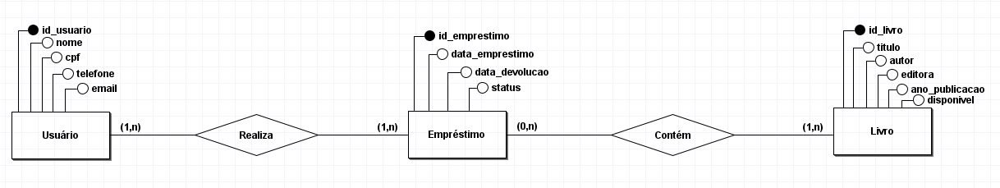

# Questão 10 - Projeto Livre

## 1.

## 2.
Para transformar o modelo MER para o Relacional, é possível seguindo algumas etapas de mapeamento, como transformar cada entidade em tabela. Assim sendo: Primeiro, cada entidade do modelo conceitual originou uma tabela correspondente no modelo lógico. Segundo, os atributos simples das entidades foram convertidos diretamente em colunas das tabelas. Terceiro, os relacionamentos com cardinalidade 1:N foram implementados através da inclusão de chaves estrangeiras na tabela do lado "muitos" do relacionamento.
A tabela "EMPRESTIMO" funciona como o elemento central do sistema, conectando usuários aos livros que eles pegam emprestado. As chaves estrangeiras garantem a integridade referencial, impedindo que sejam registrados empréstimos para usuários ou livros inexistentes no banco de dados.